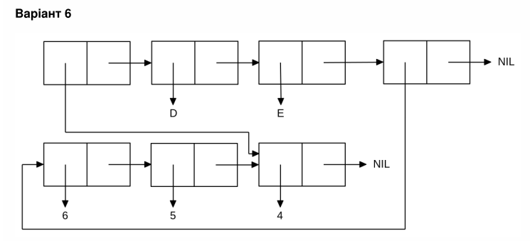

<p align="center"><b>МОНУ НТУУ КПІ ім. Ігоря Сікорського ФПМ СПіСКС</b></p>

<p align="center">
<b>Звіт з лабораторної роботи 1</b><br/>
"Обробка списків з використанням базових функцій"<br/>
дисципліни "Вступ до функціонального програмування"
</p>

<p align="right"><b>Студент</b>: Козлов Сергій Олександрович група КВ-33</p>
<p align="right"><b>Рік</b>: 2026</p>

## Загальне завдання
```lisp
;; Пункт 1
cl-user>(setq *l* (list 'A 1 (list 2 'B (list 3)) () 'C))
(A 1 (2 B (3)) NIL C)

;; Пункт 2
cl-user>(first *l*)
A

;; Пункт 3
cl-user>(rest *l*)
(1 (2 B (3)) NIL C)

;; Пункт 4
cl-user>(third *l*)
(2 B (3))

;; Пункт 5
cl-user>(car (last *l*))
C

;; Пункт 6
cl-user>(atom (first *l*))
T
cl-user>(atom (second *l*))
T
cl-user>(atom (third *l*))
NIL

cl-user>(listp (first *l*))
NIL
cl-user>(listp (third *l*))
T
cl-user>(listp (fourth *l*))
T

;; Пункт 7
cl-user>(numberp (first *l*))
NIL
cl-user>(evenp (second *l*))
NIL
cl-user>(null (fourth *l*))
T

;; Пункт 8
cl-user>(append *l* (third *l*))
(A 1 (2 B (3)) NIL C 2 B (3))
```

## Варіант 6
<p align="center">

</p>

```lisp
cl-user>(setq *l* (let ((x '(4))) (list x 'D 'E (list* 6 5 x))))
((4) D E (6 5 4))

cl-user>(eq (first *l*) (last (fourth *l*)))
T
```
